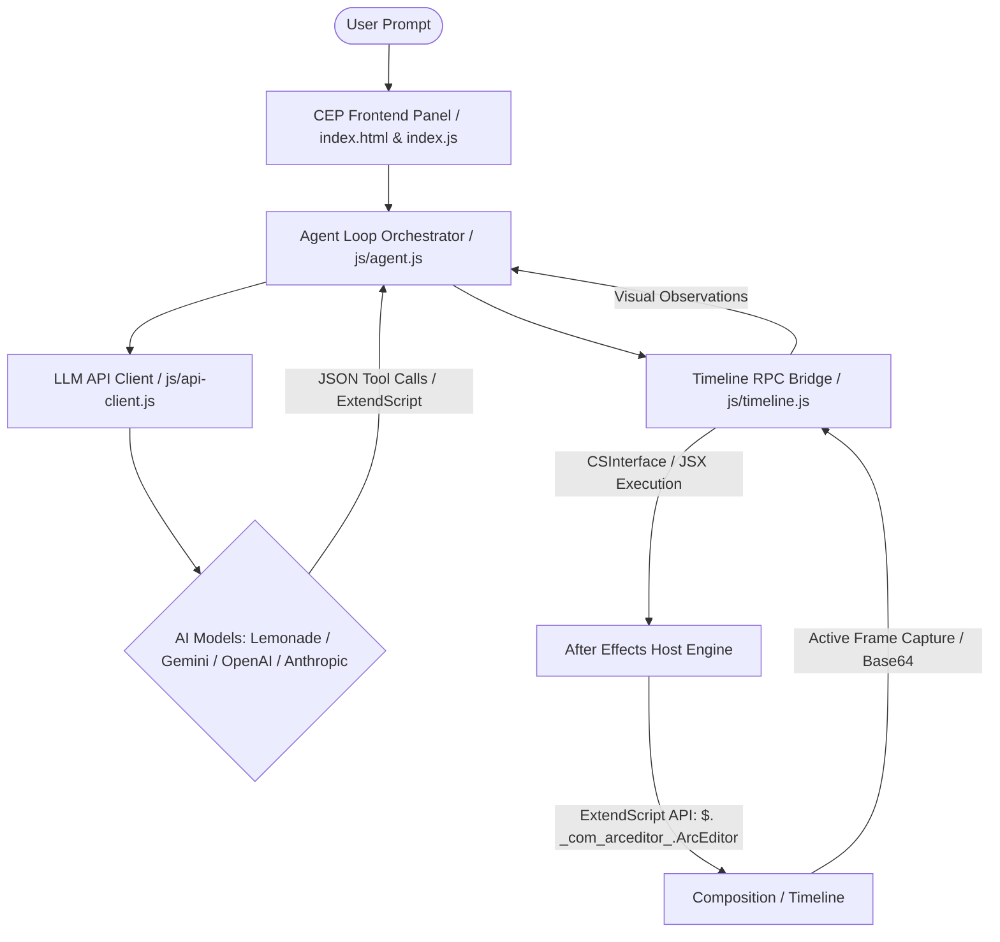

<h1 align="center">ArcEditor</h1>

</br>


ArcEditor is a context-aware AI co-pilot and timeline automation harness built as a self-contained Adobe After Effects CEP Extension. ArcEditor enables real-time natural language interaction to build, edit, and animate complex motion graphics rigs directly inside After Effects.

---

## Architecture Overview



The extension operates on a closed-loop **ReAct (Reasoning and Action) self-correction cycle**:
1. The **Agent Orchestrator** fetches structural composition context (`getTimelineContext`).
2. The **LLM Client** generates a sequence of actions or high-level ExtendScript code.
3. The **Timeline Bridge** runs the ExtendScript inside After Effects under an isolated transaction namespace (`$._com_arceditor_.ArcEditor`).
4. Visual rendering tools (`captureActiveFrame` or `captureCompositionSequence`) fetch base64 frames back to the agent for visual validation.
5. If syntax or layout runtime errors occur, the orchestrator catches them and automatically triggers self-correction loops.

---

## Key Features

* **Zero-Dependency Setup**: Runs entirely within the Adobe CEP panel context. No external terminal servers or external background processes are needed.
* **Expression-Centric Automation**: Instead of baking hardcoded keyframes, the agent creates Control Null layers containing Sliders, Angle, and Color controls, linking attributes via dynamic expressions so motion designers maintain creative control.
* **Visual & Structural Context**: Grabs active composition context, layer hierarchies, properties, and on-demand frames to let multi-modal models review layout coordinates, typography, and alignment.
* **Multi-Modal File & Video Uploads**: Drag-and-drop or select images, text files, PDFs, or video files. Videos automatically extract 5 frames at spaced intervals for vision models.
* **Chat Tabs & Recoverable History**: Manage independent chat sessions using tabs, with past chats stored in a dropdown for quick recovery.
* **Granular Security & Permissions**: Three permission levels (Request Review, Permissive, Strict) control tool execution. A static security analyzer blocks unsafe scripts (e.g., `system`, `socket`, `process`).
* **Dynamic Agent Skills**: Extends the agent prompt by loading built-in or custom Markdown skill templates (`skills/*.md`).
* **Slash Commands**: Trigger autocomplete commands (like `/grill-me` for interactive design alignment interviews).
* **Interactive Execution Planning**: Renders running step-by-step checklists in the UI panel so you can follow the agent's progress.
* **ReAct Self-Correction**: Active scripting exceptions are captured, reverted automatically via atomic Undo points, and sent back for iterative debugging.
* **Project Privacy**: Chat sessions, settings, and media analysis run completely locally on your system.

---

## Directory Structure

```text
arceditor/
├── .debug                  # Configures DevTools remote debugging port (8000)
├── CSXS/
│   └── manifest.xml        # CEP panel configuration and target AE versions
├── js/
│   ├── agent.js            # Core ReAct loop, system instructions, and prompt definitions
│   ├── api-client.js       # Outbound network adapters for AI providers
│   ├── commands.js         # Register slash commands, popup UI, and keyboard events
│   ├── instructions.js     # System instructions and ExtendScript API reference schema
│   ├── markdown-parser.js  # Client-side markdown renderer for tables, links, and code
│   ├── reasoning-parser.js # Parses thinking tokens for chain-of-thought rendering
│   ├── settings.js         # Settings manager, session storage, and disk serialization
│   ├── skills.js           # Built-in and user-defined agent skills loader
│   ├── state.js            # Panel state, file pathing, and visual attachments
│   ├── static-analyzer.js  # Scans ExtendScript code for unsafe keywords or APIs
│   └── timeline.js         # Bridge to CEP host APIs (ExtendScript execution, frame capture)
├── jsx/
│   └── host.jsx            # Native ExtendScript library ($._com_arceditor_.ArcEditor)
├── lib/
│   └── CSInterface.js      # Adobe CEP Integration library
├── skills/                 # Default agent skill templates (.md)
│   ├── 3d_camera_rig.md
│   ├── color_palette.md
│   └── line_connector.md
├── index.html              # Modern layout (Chat, Console, and Debug Log tabs)
├── index.css               # Vanilla CSS styling & premium dark glassmorphism design
├── index.js                # Panel DOM bindings and controller handlers
├── package.json            # Node.js project manifest and dependency map
└── setup_dev_mode.ps1      # Developer helper script to toggle PlayerDebugMode and symlinks
```

---

## Setup Instructions

### Option A: Automatic Setup (PowerShell)
1. Close Adobe After Effects.
2. Open **PowerShell** as an Administrator.
3. Navigate to the project directory and execute:
   ```powershell
   Set-ExecutionPolicy Bypass -Scope Process
   .\setup_dev_mode.ps1
   ```
This automatically enables Adobe `PlayerDebugMode` across CSXS versions 9 to 11 and establishes a symbolic link from the repo to Adobe's CEP extensions directory.

### Option B: Manual Setup
1. Open PowerShell and run the following commands to enable debug mode for Adobe CEP extensions:
   ```powershell
   reg add "HKCU\Software\Adobe\CSXS.9" /v PlayerDebugMode /t REG_SZ /d 1 /f
   reg add "HKCU\Software\Adobe\CSXS.10" /v PlayerDebugMode /t REG_SZ /d 1 /f
   reg add "HKCU\Software\Adobe\CSXS.11" /v PlayerDebugMode /t REG_SZ /d 1 /f
   ```
2. Copy or symlink this repository folder into:
   `%APPDATA%\Adobe\CEP\extensions\com.arceditor\`

---

## Usage Guide

1. Launch **After Effects** and open or create a composition.
2. Open the panel via **Window > Extensions > ArcEditor**.
3. Open the drawer by clicking the **Gear Icon** in the header. Set your AI provider (Gemini, OpenAI, Anthropic, or Lemonade), specify your model parameters (Temperature, Top-P, Reasoning Effort, or Thinking Budget), and configure features (Web Search, Permission Level, Allowed/Denied Tools, UI Transitions). Click **Save & Apply**.
4. The status indicator dot in the header will turn green once a successful connection is established.
5. **Chat Interface**: Describe your animation requests. Drop files or videos to upload assets or reference files.
6. **Autocomplete Commands**: Type `/` to see available slash commands. Execute `/grill-me` to start a structured alignment session to clarify design decisions before execution.
7. **JSX Console**: Test custom scripts directly, running them inside atomic undo blocks.
8. **Debug Log**: Review raw prompts, LLM reasoning steps, and executed JSON tool commands.

---

## ExtendScript API Reference (`ArcEditor`)

To simplify timeline manipulations, the host environment exposes a global API named `$._com_arceditor_.ArcEditor` (aliased as `ArcEditor` inside the agent's execution context). 

> [!NOTE]
> **Time & Frame Formats**: All time-related API arguments default to frame numbers (0-indexed). Suffixes `"f"` (frames) and `"s"` (seconds) can be appended to strings (e.g. `"45f"`, `"1.5s"`, or `"+10"`).

| Method | Description |
| :--- | :--- |
| `createLayer(type, name, size, color, options)` | Creates a new layer (`"Solid"`, `"Text"`, `"Shape"`, `"Null"`, `"Adjustment"`, `"Camera"`, `"Light"`). `options` supports `startTime`, `inPoint`, `outPoint`, `duration`, `index`, `ordering`, `relativeTo`. |
| `deleteLayer(layerRef)` | Safely deletes the specified layer. |
| `moveLayer(layerRef, position, relativeToLayerRef)` | Reorganizes layer order in the timeline stack (`"top"`, `"bottom"`, `"before"`, `"after"`). (Aliased as `reorderLayer`). |
| `applyEffect(layerRef, effectMatchName, effectDisplayName)` | Applies an effect using its native matchName. |
| `setPropertyValue(layerRef, propPath, value, time)` | Sets native layer fields (e.g., blend modes, lock, parents), solid source colors, or standard property values. |
| `getPropertyValue(layerRef, propPath)` | Retrieves the current static or animated value of a property. |
| `setPropertyExpression(layerRef, propPath, expressionStr)` | Binds a javascript expression string to a target property. |
| `getPropertyExpression(layerRef, propPath)` | Retrieves the expression string bound to a property. |
| `setKeyframes(layerRef, propPath, times, values, easeIn, easeOut)` | Generates multiple eased keyframes across the timeline. |
| `setKeyframeEasing(layerRef, propPath, keyIndex, easeIn, easeOut)` | Fine-tunes easing of an individual keyframe using Bezier objects or preset names. |
| `parentLayer(layerRef, parentLayerRef)` | Parents one layer to another. Pass `null` to unparent. |
| `trimLayer(layerRef, inPoint, outPoint, startTime, duration)` | Clips and slides the layer bounds and position in time. Also accepts an options object. |
| `precompose(layerRefs, precompName, moveAllAttributes)` | Groups an array of layers into a separate precomposition. |
| `setLayerBlendMode(layerRef, blendModeName)` | Sets the blending mode of a layer (case/space/punctuation insensitive). |
| `setTextProperties(layerRef, properties)` | Configures text content, font, size, colors, tracking, leading, and paragraph alignment in one call. |
| `addAssetToTimeline(assetRef, properties)` | Adds a project asset (file/comp) to the timeline as a layer. `properties` supports `startTime`, `inPoint`, `outPoint`, `blendMode`. |
| `setSolidColor(layerRef, color)` | Changes the source color of a Solid layer. |
| `addShapeToLayer(layerRef, shapeType, groupName, properties)` | Procedurally draws a styled shape vector group (`"Ellipse"`, `"Rect"`) with sizing, fill, stroke, and layout ordering. |
| `reorderShapeInLayer(layerRef, shapeRef, position, relativeToShapeRef)` | Reorders a shape group within a shape layer contents stack. |
| `resolveLayer(layerRef)` | Safely resolves a layer reference to a native After Effects Layer object. |
| `addMarker(type, layerRef, time, comment, duration, labelIndex)` | Appends a marker to the composition or an individual layer. Also accepts an options object. |
| `deleteMarker(type, layerRef, timeOrIndex)` | Deletes a marker from the composition or a specific layer. |

---

## Debugging and Development

### Chrome DevTools Remote Debugging
You can inspect the CEP panel UI, console outputs, and memory states using Chrome DevTools:
1. Open a Google Chrome or Microsoft Edge window.
2. Navigate to: `http://localhost:8000`.
3. Select the **ArcEditor** target link to launch the inspector.

> [!WARNING]
> The embedded CEP engine uses a custom Chromium context. Refreshing the inspector page at a very high frequency or using an incompatible remote debugger client can occasionally cause the After Effects process to crash. Ensure you avoid rapid repeated page reloads of the DevTools window.