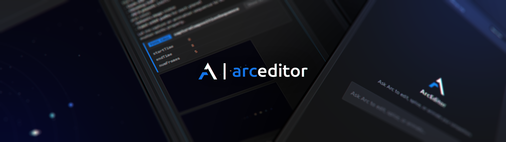

<h1 align="center">ArcEditor</h1>

 

    Videos should be editable compositions that are configurable via expressions, not flat pixels.

---

    Context-aware AI co-pilot/harness built as an Adobe After Effects CEP Extension. (basically just an agentic video editing harness)
     
    Focused on <strong>local model inference</strong> (via <a href="https://github.com/lemonade-sdk/lemonade">Lemonade</a> or OpenAI-compatible local endpoints), but also works with <a href="https://gemini.google.com/">Gemini</a>, <a href="https://openai.com/">OpenAI</a>, and <a href="https://docs.anthropic.com/">Anthropic</a> cloud providers through API keys.

---

## Architecture Overview

The extension operates on a closed-loop **ReAct (Reasoning and Action) self-correction cycle**:
1. The **Agent Orchestrator** fetches structural composition context (`getTimelineContext`).
2. The **LLM Client** generates a sequence of actions or high-level ExtendScript code.
3. The **Timeline Bridge** runs the ExtendScript inside After Effects under an isolated transaction namespace (`$._com_arceditor_.ArcEditor`).
4. Visual rendering tools (`captureActiveFrame` or `captureCompositionSequence`) fetch base64 frames back to the agent for visual validation.
5. If syntax or layout runtime errors occur, the orchestrator catches them and automatically triggers self-correction loops.

## Debugging and Development

### Chrome DevTools Remote Debugging
You can inspect the CEP panel UI, console outputs, and memory states using Chrome DevTools:
1. Open a Google Chrome or Microsoft Edge window.
2. Navigate to: `http://localhost:8000`.
3. Select the **ArcEditor** target link to launch the inspector.